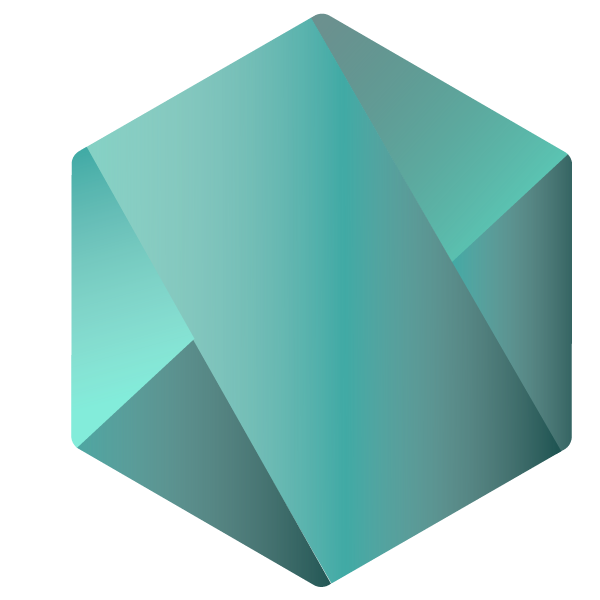
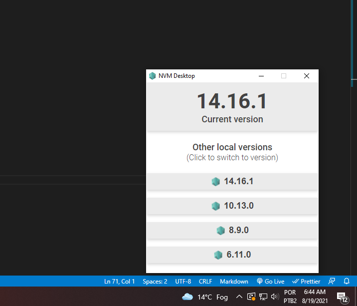

<p align="center">
  
</p>

<h1 align="center">NVM Desktop</h1>
<p align="center">A simple way to navigate between Node versions.</p>

<h3 align="center">
  <a href="#" target="_blank">
    
  </a>
</h3>

<br />


## Running locally

Clone the repository, open its folder and install dependencies with:

```sh
npm install
```

Run it using:

```sh
npm start
```

## Building

You can build the application using the following command:

```sh
npm run build
```

This will generate the `/packages` folder, and inside it you can get the `.exe` file.

## Preview

Sample preview running the app:




## Author

👤 **Gianlucca Claudino**

- Blog: [gianlucca.dev](https://www.gianlucca.dev/)
- Github: [@gianluska](https://github.com/gianluska)
- LinkedIn: [@gianlucca](https://www.linkedin.com/in/gianlucca-claudino/)

## Show your support

Give a ⭐️ if this project helped you!
